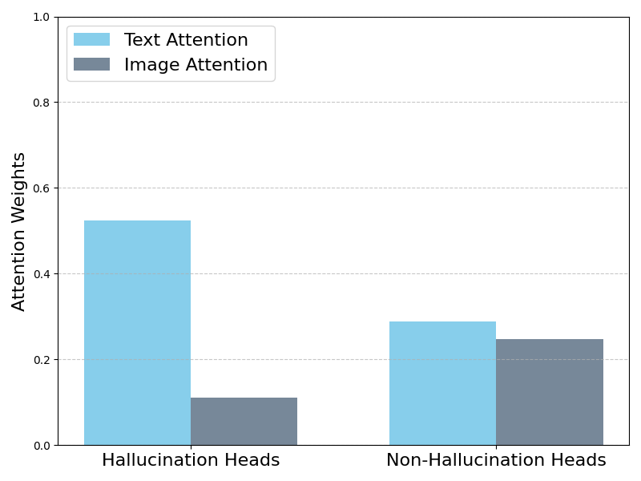
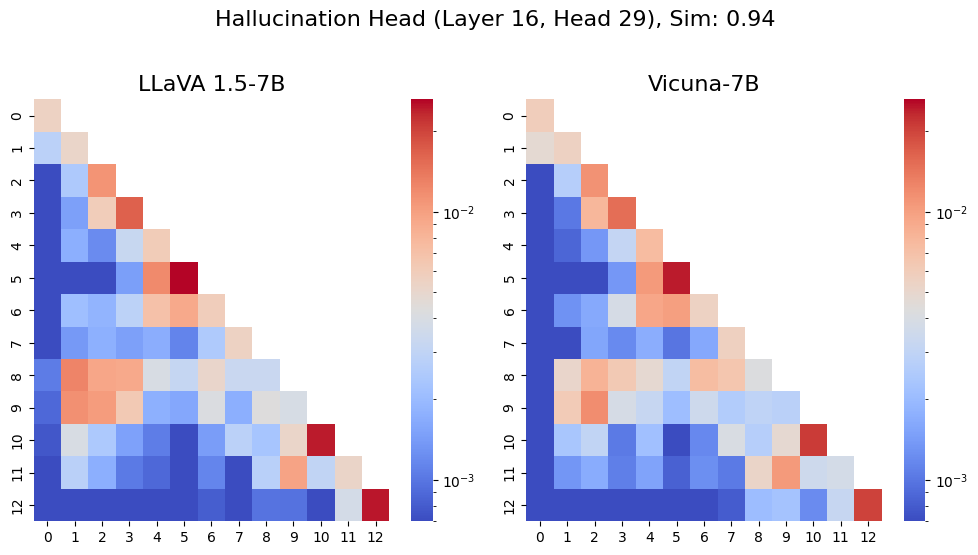
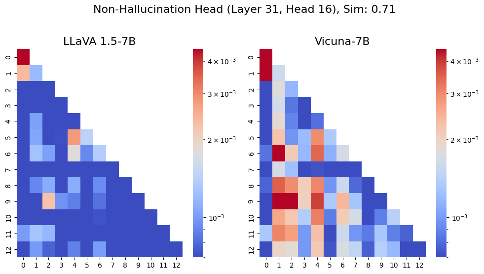
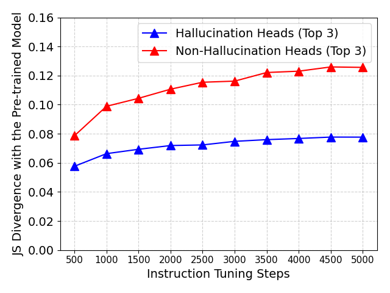
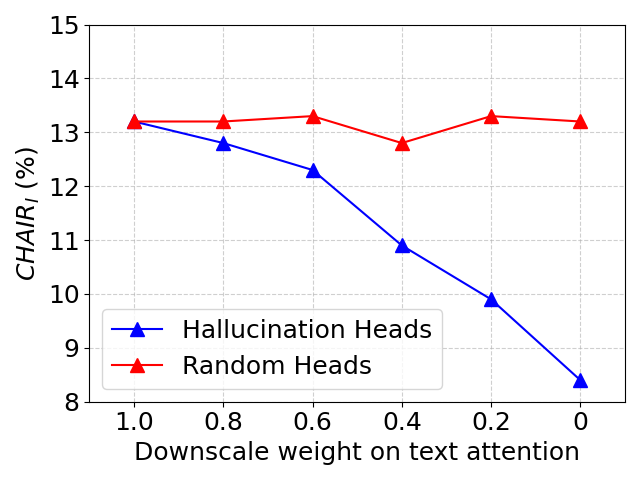
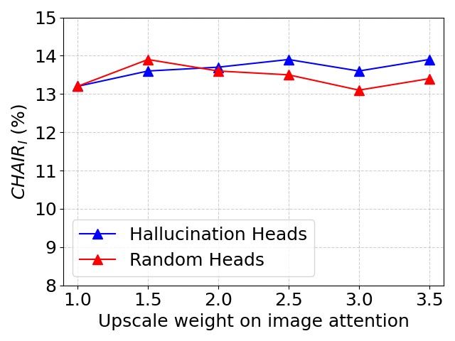

# Mitigating Hallucinations in Large Vision-Language Models via Modular Attribution and Intervention

## Overview

This repo contains the code for the paper "Mitigating Hallucinations in Large Vision-Language Models via Modular Attribution and Intervention, ICLR 2025".

This paper solves the following problems:
1. Attribution of Hallucination Components: We systematically identify and localize the components most responsible for hallucination generation in LVLMs. Specifically, we show that MHA modules, particularly certain heads in the middle and deeper layers, are key contributors.

2. Analysis of Attention Bias: We show that hallucination heads strongly favor previously generated text over visual inputs. We also reveal that this pattern is inherited from the base language model and changes slowly during the visual instruction tuning process.

3. Hallucination Mitigation Techniques: We develop two targeted strategies: one training-free for decoding and one involving fine-tuning. Both methods reduce over-reliance on text tokens, achieving a significant reduction in hallucination rates, outperforming existing baselines. 


## Demo Scripts on LLaVA

In the following, we provide code for the attribution, analysis, and intervention of hallucination heads based on LLaVA v1.5-7B model in the `LLaVA` folder.

### Setup

```
cd LLaVA
pip install -e .
```

### Identify Hallucination Heads

Dowload coco train2014 and val2014 images from [here](https://cocodataset.org/#download) and put them in `dataset/coco`.

```
sh ./bash_scripts/attribute.sh
```
The attribution result is saved in `$result_path/identify_attention_head/attribution_result.json`.

### Analyze the Behaviour of Hallucination Heads

1. The attention bias of hallucination heads, corresponding to Figure 3 in the paper.

```
sh ./bash_scripts/analysis/attention_bias.sh
```



2. The inheritance of attention patterns from base language models, corresponding to Figure 4 in the paper.
```
sh ./bash_scripts/analysis/attention_inheritance.sh
```



3. The JS divergence of the attention map from the initial model throughout the instruction tuning process, corresponding to Figure 5 in the paper. We provide the checkpoints during the instruction tuning process [here](https://huggingface.co/TianyunYoung/llava-v1.5-7b-instruction-tuning-checkpoints/tree/main), put them in `checkpoints/llava-v1.5-7b-instruction-tuning`.
```
sh ./bash_scripts/analysis/js_div_in_training.sh
```


4. The effect of downscaling the text attention of hallucination and random heads, Figure 6(a) in the paper.
```
sh ./bash_scripts/analysis/attention_reweight_txt.sh
```



5. The effect of upscaling the image attention of hallucination and random heads, Figure 6(b) in the paper.
```
sh ./bash_scripts/analysis/attention_reweight_img.sh
```



### Intervention 

1. Training-free intervention method based on adaptive deactivation of hallucination head. We provide the intervention code for LLaVA v1.5-7B, LLaVA v1.5-13B, and LLaVA v1.6-34B.

```bash
sh ./bash_scripts/decoding.sh
```

2. Training-based intervention method based on targeted fine-tuning of hallucination head. We use the `llava_v1_5_mix665k.json` from [LLaVA](https://github.com/haotian-liu/LLaVA/?tab=readme-ov-file) as the training data.

```bash
sh ./bash_scripts/targeted_finetune.sh
```
- We provide the fine-tuned model of [LLaVA](https://huggingface.co/TianyunYoung/llava-v1.5-7b-targeted-finetuned) and [MiniGPT4](https://huggingface.co/TianyunYoung/minigpt4-finetuned/tree/main).


## Comparison with Baseline methods

We provide the evaluation code for the following baseline methods and our method in the `baselines` folder. The baseline implementation of baseline methods are mostly based on [HALC](https://github.com/BillChan226/HALC). The evaluation results in our paper are based on this code to ensure fair comparison with the baseline methods:

- Greedy decoding
- VCD
- DOLA
- HALC
- OPERA


### Setup
```
conda env create -f environment.yml
conda activate baselines
```
Download `pretrained_minigpt4_llama2_7b.pth` from [here](https://huggingface.co/juliozhao/pretrained_minigpt4_llama2_7b/blob/0db7eb37de990b48511520894753354861d616d4/pretrained_minigpt4_llama2_7b.pth) and put in the directory `baselines/model_checkpoints`

Download `groundingdino_swint_ogc.pth` from [here](https://github.com/IDEA-Research/GroundingDINO/releases/download/v0.1.0-alpha/groundingdino_swint_ogc.pth) and put in the directory `baselines/decoder_zoo/GroundingDINO/weights`

### Evaluation

Evaluate the baseline methods: Greedy decoding, VCD, DOLA, HALC, OPERA
```
cd baselines
sh ./bash_scripts/eval_baselines.sh
```

Evaluate our methods: TFHH and ADHH
```
sh ./bash_scripts/eval_ours_adhh.sh
sh ./bash_scripts/eval_ours_tfhh.sh
```

## Evaluation on Newer Models

Our method is also applicable to newer models. We provide the evaluation code for the following newer models in the `newer_models` folder. Note that to support the evaluation of newer models, we need to install higher version of `transformers`, we use `transformers==4.45.2`. We provide the naive method of completely removing hallucination heads of the newer models for reference.

- Llama3.2-11B
- Chameleon-7B
- Chameleon-30B
 
```
cd newer_models
sh decoding.sh
```

## Acknowledgement

This repo is based on the MLLM codebase of [LLaVA](https://github.com/haotian-liu/LLaVA), the baseline implementation of [HALC](https://github.com/BillChan226/HALC). Thanks for their impressive works!

